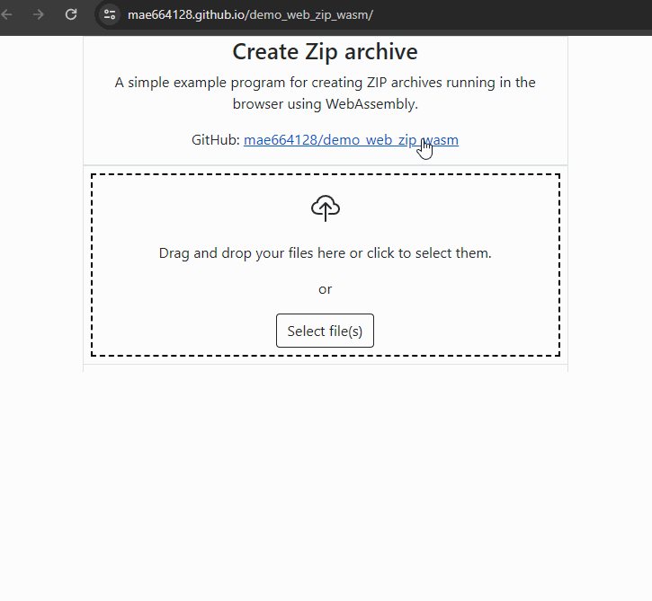

Here’s an attractive and informative README for your **Zip-Creater** project:

---

# Zip-Creater

An easy-to-use, efficient solution for creating ZIP archives directly from the browser using WebAssembly! This project leverages the power of Rust and WebAssembly to bring high-speed file compression to the web without relying on server-side resources.



### 🚀 [Online Demo](https://mae664128.github.io/demo_web_zip_wasm/)

## 🌟 Features
- **WebAssembly-powered:** Achieve fast and efficient ZIP file creation directly in your browser.
- **No Server Dependency:** Perform all tasks locally, ensuring data privacy and security.
- **User-friendly Interface:** Simple drag-and-drop to add files and create your ZIP archives.
- **Cross-platform:** Works seamlessly across modern browsers without installation.

## 💻 Getting Started

To get started with **Zip-Creater** on your local machine, follow these steps:

### Prerequisites

Ensure you have the following installed:

- **Rust**: [Install Rust](https://www.rust-lang.org/tools/install)
- **Wasm-pack**: [Install wasm-pack](https://rustwasm.github.io/wasm-pack/installer/)

### Installation

1. Clone the repository:

```bash
git clone https://github.com/chrohangurjar1/Zip-Creater.git
```

2. Navigate to the project folder:

```bash
cd Zip-Creater
```

3. Build the WebAssembly package using `wasm-pack`:

```bash
wasm-pack build --target web
```

4. Open the `index.html` file in your browser to see the project in action.

### Optional: Use a Local Server

For a better development experience, it's recommended to run the project using a local server. You can use any static file server like `http-server` or `live-server`.

For `http-server`, use the following commands:

```bash
npm install -g http-server
http-server .
```

Now visit `http://localhost:8080` in your browser to try the demo.

## 🎨 Demo

Check out the live demo of **Zip-Creater** by clicking on the link below:

🌐 [Online Demo](https://mae664128.github.io/demo_web_zip_wasm/)

## 🔧 How It Works

This project is built using **Rust** and **WebAssembly** to ensure maximum performance and efficiency. Files are added to the archive via a user-friendly interface, and the ZIP file is generated locally in the browser.

Key technologies used:
- **Rust** for high-performance file compression
- **WebAssembly** to run Rust code directly in the browser
- **HTML/CSS/JavaScript** for the front-end interface

## 💡 Contributing

We welcome contributions from developers! If you have suggestions or improvements, feel free to fork the repository, create a branch, and submit a pull request.

To contribute:

1. Fork the repository
2. Create your feature branch (`git checkout -b feature/YourFeature`)
3. Commit your changes (`git commit -m 'Add some feature'`)
4. Push to the branch (`git push origin feature/YourFeature`)
5. Create a new Pull Request

## 📜 License

This project is licensed under the MIT License - see the [LICENSE](LICENSE) file for details.

## 🤝 Acknowledgments

Special thanks to the Rust and WebAssembly communities for providing the tools and inspiration to bring this project to life!

---

This README provides clear instructions, details about the project’s features, and usage for anyone who would like to contribute or use it. Let me know if you'd like any more details added!
